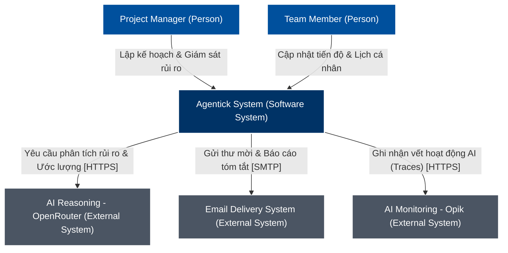
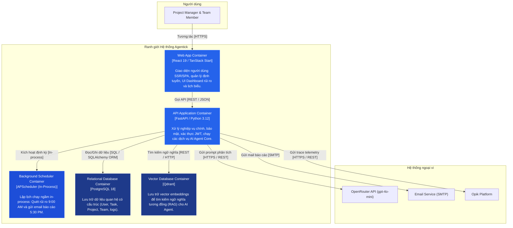
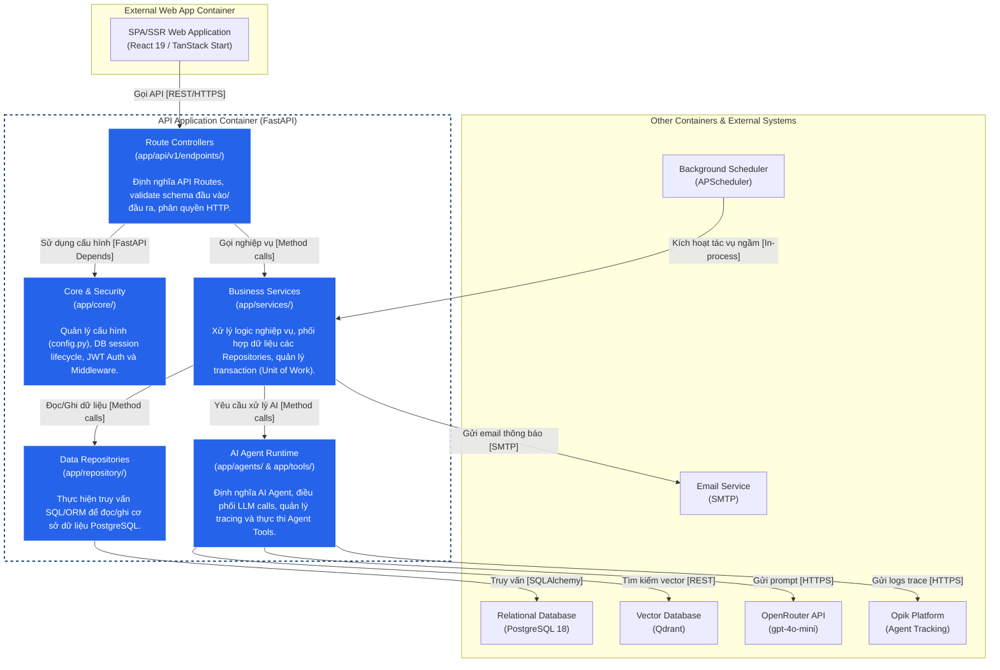
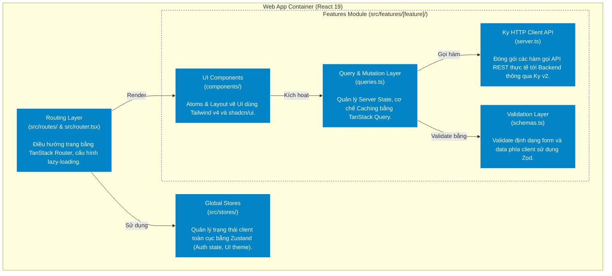

# Đặc tả Kiến trúc Hệ thống Agentick (C4 Model)

Tài liệu này mô tả chi tiết kiến trúc của nền tảng quản lý công việc tích hợp AI **Agentick**, được phân rã thành 3 cấp độ (System Context, Containers, Components) theo mô hình chuẩn C4 Model. Tài liệu bám sát 100% mã nguồn thực tế của dự án Frontend (React 19 / TanStack Start) và Backend (FastAPI / Python 3.12).

---

## LEVEL 1: SYSTEM CONTEXT (BẢN VẼ NGỮ CẢNH HỆ THỐNG)

Mô tả mối quan hệ giữa Người dùng, Hệ thống Agentick và các Hệ thống ngoại vi (bên thứ ba) ở mức cao nhất nhằm cung cấp góc nhìn tổng quan (Big Picture).

### 1. Sơ đồ Ngữ cảnh hệ thống (System Context Diagram)

### 2. Đặc tả các phần tử cốt lõi
* **Con người (Actors):**
  * **Project Manager (Quản lý dự án):** Người lập kế hoạch, phân công công việc, giám sát tiến độ dự án và theo dõi các cảnh báo rủi ro trễ hạn từ AI.
  * **Team Member (Thành viên):** Người thực thi công việc, cập nhật tiến độ task và khai báo lịch trình làm việc cá nhân.
* **Hệ thống phần mềm trung tâm (Software System):**
  * **Agentick System:** Nền tảng quản lý dự án tích hợp AI Agent chủ động phân tích rủi ro và tối ưu hóa vận hành.
* **Hệ thống ngoại vi (External Systems):**
  * **OpenRouter (AI Reasoning):** Cổng kết nối API cung cấp các mô hình ngôn ngữ lớn (mặc định `openai/gpt-4o-mini`) để thực hiện các phân tích rủi ro và ước lượng deadline.
  * **Opik (AI Monitoring):** Nền tảng giám sát AI, theo dõi chi tiết các traces/spans chạy ngầm của AI Agent nhằm tối ưu hóa chi phí token và hiệu suất.
  * **Email Delivery System:** Dịch vụ gửi email (SMTP) hỗ trợ phân phối thư mời thành viên và báo cáo rủi ro hàng ngày.

---

## LEVEL 2: CONTAINER (BẢN VẼ THÀNH PHẦN CHẠY ĐỘC LẬP)

Mô tả các thành phần chạy độc lập (containers) cấu thành nên hệ thống Agentick, chỉ rõ ranh giới công nghệ và các giao thức giao tiếp vật lý.

### 1. Sơ đồ Container (Container Diagram)

### 2. Đặc tả kỹ thuật các Containers
* **Web App (SPA / SSR):** React 19 + TanStack Start. Cung cấp UI lịch làm việc, quản lý công việc và báo cáo tổng quan. Chạy trực tiếp trên trình duyệt của người dùng.
* **API Application:** FastAPI (Python 3.12) chạy trên máy chủ. Điểm tiếp nhận trung tâm của toàn bộ logic nghiệp vụ qua các API endpoints RESTful.
* **Background Scheduler:** APScheduler. Thư viện lập lịch chạy ngầm **in-process** (cùng tiến trình Backend) để thực hiện quét rủi ro (9:00 AM) và báo cáo (5:30 PM) theo múi giờ riêng của từng dự án.
* **Relational Database:** PostgreSQL 18. Lưu trữ dữ liệu quan hệ có cấu trúc của hệ thống, kết nối qua SQLAlchemy ORM.
* **Vector Database:** Qdrant. Lưu trữ các vector embeddings để phục vụ tìm kiếm ngữ nghĩa cho AI Agent (RAG).

---

## LEVEL 3: COMPONENT (CHI TIẾT LOGIC MÃ NGUỒN)

Zoom chi tiết vào cấu trúc tổ chức mã nguồn thực tế của hai Container chính là **API Application (Backend)** và **Web App (Frontend)**.

### 1. Phân rã Component trong API Application (Backend - FastAPI)

Sơ đồ mô tả cấu trúc thư mục của dự án `Agentick-BE` và mối liên kết nghiệp vụ:

#### Đặc tả chi tiết các Components phía Backend (FastAPI):
* **Route Controllers (`app/api/v1/endpoints/`):**
  * *Nhiệm vụ:* Định nghĩa các đường dẫn HTTP (ví dụ: `projects.py`, `tasks.py`, `agent.py`, `teams.py`). Tiếp nhận request, xác thực quyền truy cập HTTP và bọc kết quả trả về trong schema cấu trúc `ResponseSchema` chuẩn hóa.
  * *Mã nguồn thực tế:* Sử dụng FastAPI `Depends` để tiêm các dịch vụ nghiệp vụ cần thiết.
* **Core & Security (`app/core/`):**
  * *Nhiệm vụ:* Quản lý cấu hình config qua Pydantic Settings (`config.py`). Quản lý xác thực JWT và phân quyền (`security.py`). Cung cấp DB session `get_db()` dùng chung trong vòng đời request (`dependencies.py`).
* **Business Services (`app/services/`):**
  * *Nhiệm vụ:* Trái tim xử lý nghiệp vụ chính của hệ thống.
  * *Mã nguồn thực tế:* `risk_analysis_service.py` điều phối quy trình phân tích rủi ro của task; `estimation_service.py` phối hợp ước lượng deadline; `invitation_service.py` xử lý logic tạo và gửi thư mời thành viên.
* **Data Repositories (`app/repository/`):**
  * *Nhiệm vụ:* Đóng gói toàn bộ các thao tác truy vấn cơ sở dữ liệu quan hệ (PostgreSQL).
  * *Mã nguồn thực tế:* `user_repository.py`, `task_repository.py`, `project_repository.py` kế thừa từ `BaseRepository` của SQLAlchemy, tránh rò rỉ logic HTTP hoặc nghiệp vụ xuống database.
* **AI Agent Runtime (`app/agents/` & `app/tools/`):**
  * *Nhiệm vụ:* Môi trường thực thi của Agentic AI.
  * *Mã nguồn thực tế:*
    * `llm_strategy.py`: Định nghĩa Interface `LLMStrategy` và triển khai lớp cụ thể `OpenRouterStrategy`.
    * `custom_agent.py`: Khởi tạo thực thể AI Agent, điều phối prompt, gọi các công cụ bổ trợ (`app/tools/task_tools.py`) để thu thập dữ liệu và tích hợp decorator `@track` của **Opik** phục vụ tracing.

---

### 2. Phân rã Component trong Web App (Frontend - React 19 / TanStack)

Frontend (`Agentick-FE`) được cấu trúc theo mô hình **Feature-based**, tự đóng gói các logic nghiệp vụ theo từng module tính năng:

#### Đặc tả chi tiết các Components phía Frontend (React 19):
* **Routing Layer (`src/routes/`):** Sử dụng **TanStack Router**. File `routeTree.gen.ts` được tự động sinh ra dựa trên cấu trúc thư mục vật lý trong `src/routes/` (như trang `/dashboard`, `/projects`, `/tasks`).
* **Global Stores (`src/stores/`):** Sử dụng **Zustand** để đồng bộ trạng thái đăng nhập của người dùng (`authStore`) và cấu hình giao diện.
* **Feature Modules (`src/features/[feature]/`):** Chia nhỏ ứng dụng thành các module tính năng độc lập (như `projects`, `tasks`, `teams`, `inbox`). Mỗi module tự đóng gói:
  * `components/`: UI cụ thể của tính năng được vẽ dựa trên nền tảng **Tailwind CSS v4** và **shadcn/ui**.
  * `queries.ts`: Cấu hình các API Queries và Mutations sử dụng **TanStack Query** để quản lý caching, tối ưu hóa request và đồng bộ hóa trạng thái tức thì với Backend.
  * `server.ts`: Sử dụng thư viện **Ky v2** để định nghĩa các hàm gửi request lên Backend API.
  * `schemas.ts`: Sử dụng **Zod** để định nghĩa schema và validate dữ liệu form trước khi gửi lên Backend.

---

## BẢNG MA TRẬN KẾT NỐI VÀ GIAO THỨC (INTERFACE MATRIX)

Đặc tả chi tiết toàn bộ các cổng giao tiếp vật lý và luồng dữ liệu truyền nhận trong hệ thống Agentick:

| STT | Container Nguồn | Container Đích | Giao thức (Protocol) | Cổng (Port) | Bản chất dữ liệu truyền nhận |
| :--- | :--- | :--- | :--- | :--- | :--- |
| **1** | Client Browser | Web App (SPA/SSR) | HTTP / HTTPS | `80` / `443` | Tải tài nguyên tĩnh (HTML, JS, CSS, Media). |
| **2** | Web App (SPA/SSR) | API Application | REST / HTTPS | `8000` | Gửi payload JSON yêu cầu nghiệp vụ (CRUD, Auth, trigger AI). |
| **3** | API Application | Relational DB | SQL (SQLAlchemy) | `5432` | Đọc/ghi thông tin người dùng, công việc, dự án, token log. |
| **4** | API Application | Vector DB | REST / HTTP | `6333` | Lưu trữ vector embeddings và truy vấn tìm kiếm ngữ nghĩa. |
| **5** | API Application | Background Scheduler | In-process Async calls | N/A | Điều phối kích hoạt các jobs (`morning_scan`, `evening_summary`). |
| **6** | API Application | OpenRouter (AI) | REST / HTTPS | `443` | Gửi prompt phân tích rủi ro, nhận điểm số và khuyến nghị AI. |
| **7** | API Application | Opik (Monitoring) | REST / HTTPS | `443` | Đẩy dữ liệu telemetry tracking LLM (Input/Output tokens, latency). |
| **8** | API Application | Email Service (SMTP) | SMTP (STARTTLS) | `587` | Gửi HTML Email báo cáo rủi ro công việc và thư mời thành viên. |
