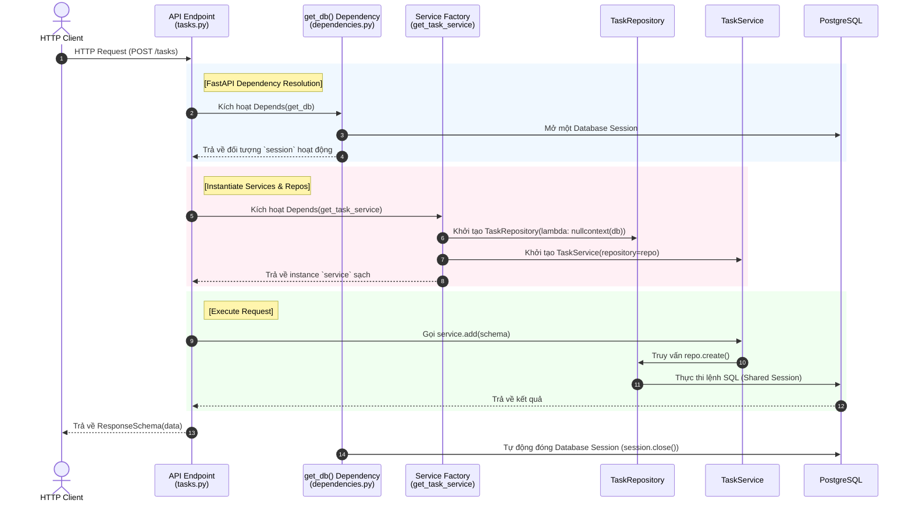
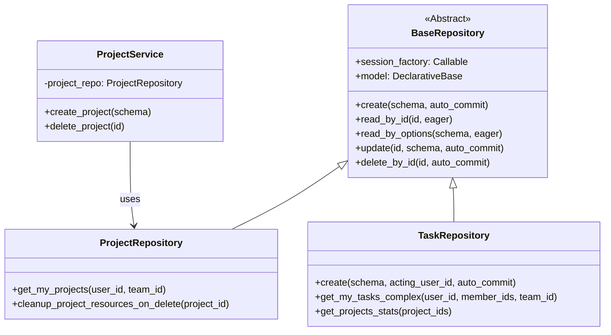
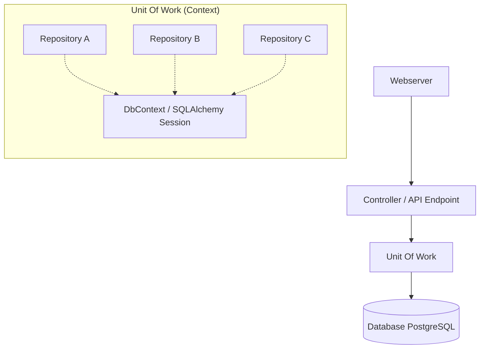
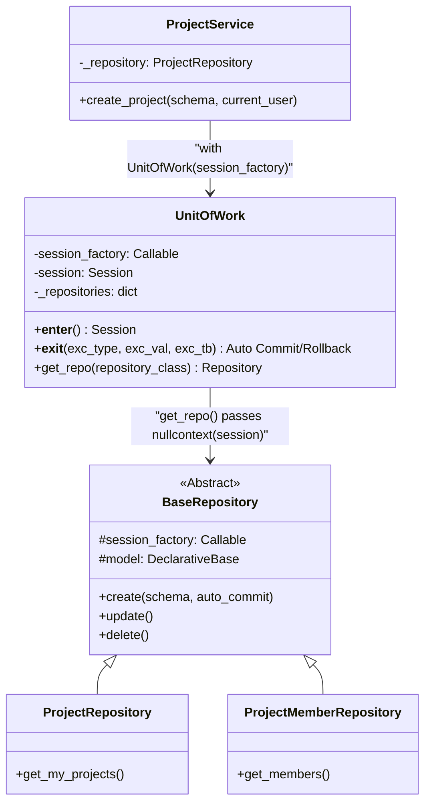
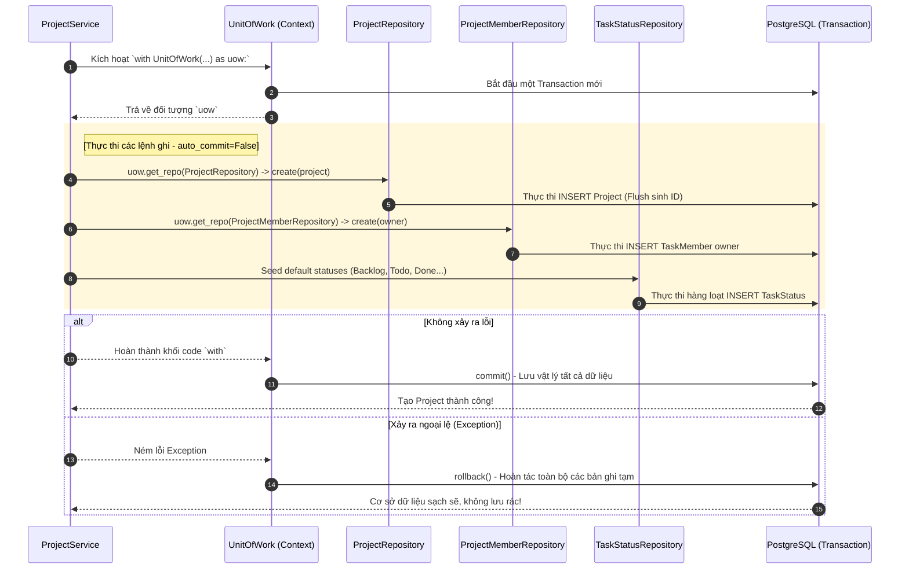
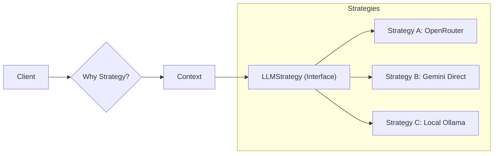
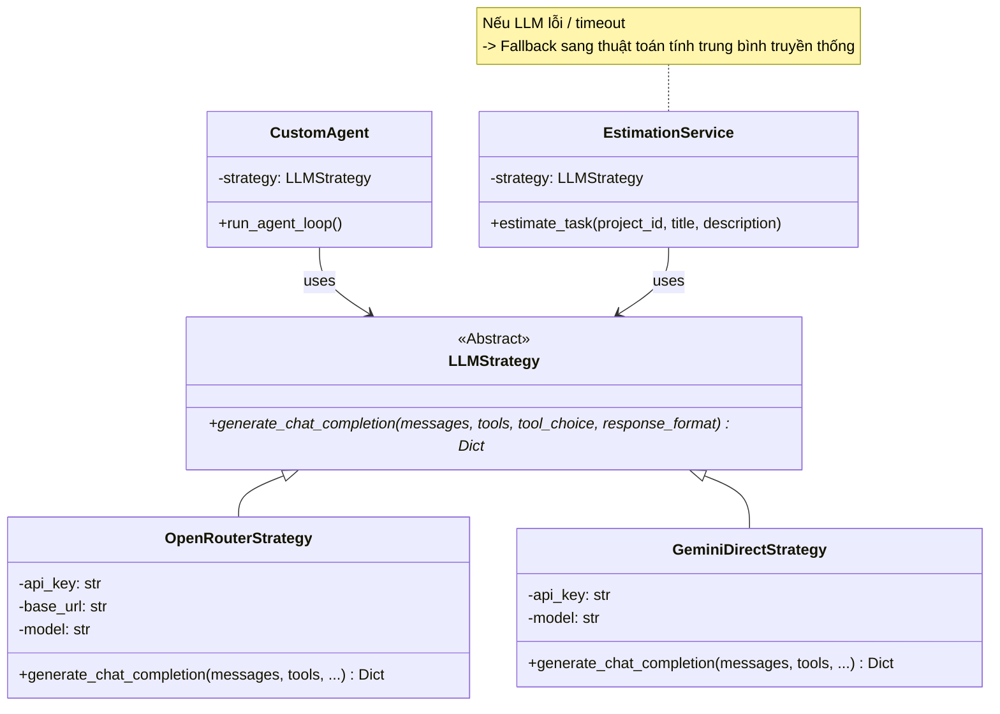

# Đặc tả các Mẫu Thiết Kế Dự Án Agentick (Design Patterns)

Tài liệu này phân tích chi tiết 4 mẫu thiết kế (Design Patterns) trọng tâm được ứng dụng trong nền tảng **Agentick**, bám sát nội dung slide từ **3.4 đến 3.4.4** và 9 slide hình ảnh kiến trúc đi kèm. Tài liệu định nghĩa rõ ràng khái niệm, phân nhóm thiết kế, lợi ích thực tiễn, sơ đồ vận hành, sơ đồ cấu trúc lớp (Class Diagram) và cách các pattern này được triển khai thực tế trên mã nguồn của dự án.

> [!NOTE]
> Phiên bản tài liệu gốc được lưu tại codebase dự án: [design_patterns.md](file:///d:/Dev%20projects/Agentick-BE/docs/architecture/design_patterns.md).
>
> Xem thêm tài liệu Kiến trúc dự án tại: [project_architecture.md](file:///d:/Dev%20projects/Agentick-BE/docs/architecture/project_architecture.md).

---

## MỤC LỤC
1. [DEPENDENCY INJECTION (DI - TIÊM PHỤ THUỘC)](#1-dependency-injection-di---tiem-phu-thuoc)
2. [REPOSITORY PATTERN (MẪU KHO LƯU TRỮ)](#2-repository-pattern-mau-kho-luu-tru)
3. [UNIT OF WORK PATTERN (UOW - ĐƠN VỊ NGHIỆP VỤ)](#3-unit-of-work-pattern-uow---don-vi-nghiep-vu)
4. [STRATEGY PATTERN (MẪU CHIẾN LƯỢC)](#4-strategy-pattern-mau-chien-luoc)

---

## 1. DEPENDENCY INJECTION (DI - TIÊM PHỤ THUỘC)

### 1.1. Khái niệm và vị trí phân nhóm
*   **Phân nhóm:** Thuộc nhóm **Creational Patterns** (Mẫu thiết lập / Khởi tạo) - Thực hiện nguyên lý cốt lõi **Inversion of Control (IoC - Đảo ngược điều khiển)**.
*   **Nguyên lý IoC:** Đảo ngược cơ chế tự kiểm soát và tự tạo dependency của một đối tượng. Thay vì một Class tự viết mã khởi tạo các lớp phụ thuộc của nó (hard-coded dependencies), các phụ thuộc này sẽ được cấu hình và truyền từ bên ngoài vào đối tượng tại thời điểm khởi tạo thông qua Constructor hoặc Parameter.

### 1.2. Áp dụng thực tế trong FastAPI (Python)
> [!NOTE]
> Khác với các framework như Java Spring (nơi DI được quét và giữ dưới dạng toàn cục - Singleton trong IoC Container), FastAPI triển khai DI thông qua hệ thống **Request-Scoped Dependencies** sử dụng hàm **`Depends()`**. Mỗi HTTP request gửi tới hệ thống sẽ kích hoạt việc khởi tạo một chuỗi dependency cô lập dành riêng cho request đó và tự động dọn dẹp (close session) khi request kết thúc.

#### Lợi ích thực tế:
*   **Giảm thiểu coupling (sự kết gắn chặt):** Tránh việc cứng hóa mã nguồn (hard-code dependencies), giúp dễ dàng thay đổi cấu hình phụ thuộc cho toàn dự án.
*   **Tách biệt mối quan tâm (SoC):** Đảm bảo Endpoint (Controller) siêu mỏng, hoàn toàn không biết gì về **cách tạo ra** các thành phần được phụ thuộc (như DB engine, session pool).
*   **Quản lý tài nguyên an toàn:** Đảm bảo tính nhất quán tuyệt đối trong **quản lý Cơ sở dữ liệu Session**, tránh xung đột dữ liệu chéo request và leak connection.

#### Sơ đồ Tuần tự của Dependency Injection trong Agentick:



### 1.3. Khớp mã nguồn thực tế (Code Mapping)

#### Hàm sinh Session Database
Được định nghĩa tại [app/core/dependencies.py](file:///d:/Dev%20projects/Agentick-BE/app/core/dependencies.py#L18-L20):
```python
def get_db() -> Generator:
    with get_database().session() as session:
        yield session  # Yield session ra cho các dependency factory khác sử dụng
```

#### Nhà máy tiêm phụ thuộc (Dependency Factory)
Được định nghĩa tại [app/api/v1/endpoints/tasks.py](file:///d:/Dev%20projects/Agentick-BE/app/api/v1/endpoints/tasks.py#L21-L32):
```python
def get_task_service(db=Depends(get_db)) -> TaskService:
    # 1. Khởi tạo Repository bằng cách inject Database Session qua lambda: nullcontext
    task_repository = TaskRepository(lambda: nullcontext(db))
    # 2. Khởi tạo Service bằng cách inject Repository vừa tạo
    return TaskService(repository=task_repository)

def get_project_permission_service(db=Depends(get_db)) -> ProjectPermissionService:
    # Chia sẻ CHUNG 1 Database session cho tất cả repositories được inject
    return ProjectPermissionService(
        project_repository=ProjectRepository(lambda: nullcontext(db)),
        project_member_repository=ProjectMemberRepository(lambda: nullcontext(db)),
        team_member_repository=TeamMemberRepository(lambda: nullcontext(db)),
        task_repository=TaskRepository(lambda: nullcontext(db)),
    )
```

#### Endpoint sử dụng DI
Được định nghĩa tại [app/api/v1/endpoints/tasks.py](file:///d:/Dev%20projects/Agentick-BE/app/api/v1/endpoints/tasks.py#L36-L46):
```python
@router.post("", response_model=ResponseSchema[TaskRead])
def create_task(
    schema: TaskCreate,
    current_user: User = Depends(get_current_active_user),
    # Inject Service tự động dựa trên Depends
    service: TaskService = Depends(get_task_service),
    permission_service: ProjectPermissionService = Depends(
        get_project_permission_service
    ),
):
    permission_service.ensure_project_task_write(schema.project_id, current_user.id)
    result = service.add(schema, acting_user_id=current_user.id)
    return ResponseSchema(data=result, message="Task created successfully")
```

---

## 2. REPOSITORY PATTERN (MẪU KHO LƯU TRỮ)

### 2.1. Khái niệm và vị trí phân nhóm
*   **Phân nhóm:** Thuộc nhóm **Object-Relational Metadata Mapping Patterns** (trong Enterprise Application Architecture) - Nằm trong triết lý cốt lõi của **Domain-Driven Design (DDD)**.
*   **Khái niệm:** Đóng vai trò là một lớp trung gian giữa tầng nghiệp vụ miền (Business Logic Domain) và tầng ánh xạ dữ liệu vật lý (Data Mapping / ORM). Nó cung cấp một giao diện giống như tập hợp trong bộ nhớ (Collection-like Interface) để các Use Case tương tác với dữ liệu thực thể mà không cần biết cách dữ liệu được lưu trữ hay truy vấn vật lý thế nào.

### 2.2. Áp dụng thực tế trong Agentick
> [!TIP]
> Hệ thống xây dựng một lớp cơ sở **`BaseRepository`** đóng gói toàn bộ các hàm CRUD SQLAlchemy phức tạp. Các repository con (như `TaskRepository`, `ProjectRepository`) kế thừa lớp cha này và cài đặt các hàm query đặc thù, giúp triệt tiêu mã nguồn trùng lặp.

#### Lợi ích thực tế:
*   **Tập trung hóa logic truy vấn dữ liệu:** Triệt tiêu hoàn toàn mã SQL hoặc SQLAlchemy ORM rải rác ở tầng Service hay Controller.
*   **Dễ dàng bảo trì và tối ưu:** Khi cấu trúc bảng thay đổi hoặc cần tối ưu câu lệnh SQL, lập trình viên chỉ cần chỉnh sửa tại một nơi duy nhất (Repository tương ứng).
*   **Độc lập hạ tầng DB:** Dễ dàng hoán đổi từ PostgreSQL sang các loại cơ sở dữ liệu khác chỉ bằng việc thay đổi cài đặt nội bộ trong Repository mà không làm ảnh hưởng đến tầng nghiệp vụ Service.

#### Sơ đồ lớp (Class Diagram) của Repository Pattern trong dự án:



### 2.3. Khớp mã nguồn thực tế (Code Mapping)

#### Lớp cha BaseRepository
Được định nghĩa tại [app/repository/base_repository.py](file:///d:/Dev%20projects/Agentick-BE/app/repository/base_repository.py#L12):
```python
class BaseRepository:
    def __init__(self, session_factory: Callable[[], AbstractContextManager[Session]], model: type[ModelT]) -> None:
        self.session_factory = session_factory
        self.model = model

    def read_by_id(self, id: str, eager: bool = False) -> ModelT:
        with self.session_factory() as session:
            query = session.query(self.model).filter(self.model.id == id)
            # Eager load relationships if enabled
            if eager and hasattr(self.model, "eagers"):
                for rel in self.model.eagers:
                    query = query.options(joinedload(getattr(self.model, rel)))
            item = query.first()
            if not item:
                raise NotFoundError(detail=f"Not found id : {id}")
            return item
```

#### Lớp con TaskRepository kế thừa và ghi đè
Được định nghĩa tại [app/repository/task_repository.py](file:///d:/Dev%20projects/Agentick-BE/app/repository/task_repository.py#L12):
```python
class TaskRepository(BaseRepository):
    def __init__(self, session_factory):
        # Truyền Session Factory và Model Task đại diện xuống lớp cha
        super().__init__(session_factory, Task)

    def create(self, schema, acting_user_id: str = None, auto_commit=True):
        # Ghi đè phương thức tạo để xử lý nghiệp vụ phức tạp:
        # Tách member_ids, tự động gán status life-cycle times, chèn bản ghi TaskMember lead/member,
        # và kích hoạt đồng bộ hóa vector RAG lên Qdrant DB.
        ...
```

---

## 3. UNIT OF WORK PATTERN (UOW - ĐƠN VỊ NGHIỆP VỤ)

### 3.1. Khái niệm và vị trí phân nhóm
*   **Phân nhóm:** Thuộc nhóm **Object-Relational Behavioral Patterns** (trong Enterprise Application Architecture) do Martin Fowler định nghĩa.
*   **Khái niệm:** Unit of Work duy trì danh sách tất cả các đối tượng tham gia vào một giao dịch nghiệp vụ (business transaction). Nó điều phối việc lưu trữ các thay đổi và giải quyết các vấn đề đồng thời (concurrency), đảm bảo toàn bộ các thay đổi được commit xuống cơ sở dữ liệu **một lần duy nhất** ở cuối luồng, hoặc hoàn tác (rollback) toàn bộ nếu xảy ra bất kỳ lỗi nào.

### 3.2. Ba nguyên lý cốt lõi áp dụng trong Agentick (Slide 3.4.3):
1.  **Maintains a list (Duy trì danh sách thay đổi):** Theo dõi mọi thay đổi trạng thái của thực thể (Insert, Update, Delete) trong suốt phiên giao dịch kết nối, không để từng Repository tự ý commit đơn lẻ.
2.  **Coordinates the writing out (Điều phối ghi dữ liệu):** Gom toàn bộ các truy vấn ghi DB và thực thi ghi lưu vật lý xuống cơ sở dữ liệu một lần duy nhất vào cuối vòng đời transaction thông qua `session.commit()`.
3.  **Resolution of concurrency problems (Giải quyết tranh chấp dữ liệu):** Bảo toàn tính nhất quán (ACID) của dữ liệu khi có nhiều thao tác ghi đồng thời xảy ra, ngăn chặn việc lộ lọt dữ liệu trạng thái trung gian ra ngoài DB khi chưa hoàn tất toàn bộ nghiệp vụ.

#### Lợi ích thực tế:
*   Đảm bảo tuyệt đối **tính Atomic (Nguyên tử)** của transaction (tất cả cùng thành công hoặc cùng thất bại và thực thi rollback).
*   Tránh rò rỉ kết nối (leak connection) và ngăn ngừa việc rải rác mã điều khiển transaction ở khắp tầng Service.
*   Chia sẻ **duy nhất một Database Session** xuyên suốt cho nhiều Repository tham gia vào cùng một transaction thông qua cơ chế tiêm `nullcontext`.

#### Sơ đồ vận hành tổng quát của Unit of Work trong hệ thống:



#### Sơ đồ cấu trúc lớp (Class Diagram) cụ thể của Unit of Work trong dự án:



#### Sơ đồ hoạt động tuần tự của Unit of Work trong nghiệp vụ Tạo Project:



### 3.3. Khớp mã nguồn thực tế (Code Mapping)

#### Lớp triển khai UnitOfWork Context Manager
Định nghĩa tại [app/repository/unit_of_work.py](file:///d:/Dev%20projects/Agentick-BE/app/repository/unit_of_work.py):
```python
class UnitOfWork:
    def __init__(self, session_factory):
        self.session_factory = session_factory
        self._cm = None
        self.session = None
        self._repositories: dict[type[BaseRepository], BaseRepository] = {}

    def __enter__(self):
        # 1. Kích hoạt Session Manager thực tế để mở Session kết nối
        self._cm = self.session_factory()
        self.session = self._cm.__enter__()
        self._repositories = {}
        return self

    def get_repo(self, repository_class: type[RepositoryT]) -> RepositoryT:
        # 2. Lazy loading repository: Truyền CHUNG một DB Session qua lambda: nullcontext
        if self.session is None:
            raise RuntimeError("UnitOfWork must be entered before requesting repositories.")
        if repository_class not in self._repositories:
            self._repositories[repository_class] = repository_class(
                lambda: nullcontext(self.session)
            )
        return cast(RepositoryT, self._repositories[repository_class])

    def __exit__(self, exc_type, exc_val, exc_tb):
        # 3. Quản lý Commit / Rollback tự động
        try:
            if exc_type is not None:
                self.session.rollback()  # Rollback nếu xảy ra lỗi trong khối 'with'
            else:
                self.session.commit()    # Commit toàn bộ nếu chạy mượt mà
        finally:
            self._cm.__exit__(exc_type, exc_val, exc_tb)
```

#### Nghiệp vụ Tạo Project nguyên tử (Atomic Project Creation)
Định nghĩa tại [app/services/project_service.py](file:///d:/Dev%20projects/Agentick-BE/app/services/project_service.py#L215-L244):
```python
    def create_project(self, schema: ProjectCreate, current_user: User):
        self._ensure_user_in_team(
            schema.team_id, current_user.id, allow_roles={"owner", "manager"}
        )

        # Sử dụng Unit of Work để điều phối ghi đồng thời vào nhiều bảng
        with UnitOfWork(self._repository.session_factory) as uow:
            project_repository = uow.get_repo(ProjectRepository)
            project_member_repository = uow.get_repo(ProjectMemberRepository)

            # 1. Tạo project (không tự động commit)
            project = project_repository.create(schema, auto_commit=False)
            
            # 2. Gán người tạo làm chủ sở hữu dự án (owner)
            project_member_repository.create(
                {
                    "project_id": project.id,
                    "user_id": current_user.id,
                    "role": "owner",
                },
                auto_commit=False,
            )
            
            # 3. Seed hàng loạt catalog mặc định (Status, Type, Priority) cho Project
            self._seed_project_catalogs_via_uow(uow, project.id)

            # Kết thúc context 'with' -> UoW tự động commit toàn bộ xuống DB!
            return project
```

---

## 4. STRATEGY PATTERN (MẪU CHIẾN LƯỢC)

### 4.1. Khái niệm và vị trí phân nhóm
*   **Phân nhóm:** Thuộc nhóm **Behavioral Patterns** (Mẫu hành vi của GoF - Gang of Four).
*   **Khái niệm:** Định nghĩa một họ các thuật toán/hành vi, đóng gói từng thuật toán lại vào các lớp độc lập riêng biệt, và làm cho chúng có thể hoán đổi linh hoạt cho nhau tại thời điểm chạy (runtime) mà không làm ảnh hưởng đến các lớp client đang sử dụng chúng.

### 4.2. Áp dụng thực tế trong Agentick (Slide 3.4.4)
> [!IMPORTANT]
> Agentick sử dụng Strategy Pattern để chuẩn hóa việc giao tiếp với các nhà cung cấp AI (LLM Providers) khác nhau. Toàn bộ logic tương tác LLM được trừu tượng hóa qua giao diện **`LLMStrategy`**. Hệ thống có thể chọn hoán đổi giữa việc gọi qua cổng trung gian **`OpenRouterStrategy`** (mặc định cho GPT-4o-mini) hoặc gọi trực tiếp API Google qua **`GeminiDirectStrategy`** tại thời điểm runtime dựa trên cấu hình dự án mà không cần sửa đổi bất kỳ dòng code nghiệp vụ nào của các AI Agent Service.

#### Lợi ích thực tế:
*   **Hành vi Object linh hoạt:** Giúp hành vi của các AI Agents linh hoạt như được config, có thể thay thế mô hình ngôn ngữ lớn (LLM) nhanh chóng chỉ qua thay đổi cấu hình môi trường.
*   **Tuân thủ OCP (Open/Closed Principle):** Khi tích hợp thêm chiến lược LLM mới (như Claude SDK, Ollama Local), lập trình viên chỉ cần viết class chiến lược con mới kế thừa từ `LLMStrategy` mà không cần chỉnh sửa mã nguồn cốt lõi cũ.
*   **Cơ chế dự phòng (Fallback):** Hoán đổi strategy trên runtime dựa trên ngữ cảnh Client cần và dễ dàng xây dựng cơ chế Fallback sang các thuật toán truyền thống nếu dịch vụ AI ngoại vi xảy ra sự cố.

#### Sơ đồ lý thuyết của Strategy Pattern:



#### Sơ đồ cấu trúc lớp (Class Diagram) của Strategy Pattern trong dự án:



### 4.3. Khớp mã nguồn thực tế (Code Mapping)

#### Interface trừu tượng (Abstract Strategy) và Các lớp Chiến lược cụ thể
Được định nghĩa tại [app/agents/llm_strategy.py](file:///d:/Dev%20projects/Agentick-BE/app/agents/llm_strategy.py):
```python
class LLMStrategy(ABC):
    @abstractmethod
    async def generate_chat_completion(
        self,
        messages: List[Dict[str, Any]],
        tools: Optional[List[Dict[str, Any]]] = None,
        tool_choice: str = "auto",
        response_format: Optional[Dict[str, Any]] = None,
    ) -> Dict[str, Any]:
        """Giao diện chuẩn hóa chung cho mọi LLM Call."""
        pass


class OpenRouterStrategy(LLMStrategy):
    def __init__(self, api_key: str, base_url: str, model: str):
        self.api_key = api_key
        self.base_url = base_url
        self.model = model

    async def generate_chat_completion(self, messages, tools=None, ...):
        # Triển khai HTTP call qua client httpx tới API của OpenRouter
        ...


class GeminiDirectStrategy(LLMStrategy):
    def __init__(self, api_key: str, model: str = "gemini-2.0-flash"):
        self.api_key = api_key
        self.model = model

    async def generate_chat_completion(self, messages, tools=None, ...):
        # Triển khai logic gọi SDK trực tiếp của Google Gemini
        raise NotImplementedError("GeminiDirectStrategy is ready for integration.")
```

#### Tích hợp và Cơ chế Fallback dự phòng trong EstimationService
Được định nghĩa tại [app/services/estimation_service.py](file:///d:/Dev%20projects/Agentick-BE/app/services/estimation_service.py):
```python
class EstimationService:
    def __init__(self, task_repository: TaskRepository, strategy: Optional[LLMStrategy] = None):
        self.task_repository = task_repository
        if strategy is None:
            # Tự động gán Chiến lược mặc định dựa theo cấu hình
            strategy = OpenRouterStrategy(
                api_key=configs.OPENROUTER_API_KEY,
                base_url=configs.OPENROUTER_BASE_URL,
                model=configs.OPENROUTER_MODEL,
            )
        self.strategy = strategy

    async def estimate_task(self, project_id: str, title: str, description: str) -> dict:
        ...
        try:
            # 1. Gọi LLM thông qua Chiến lược (Strategy) được inject
            res_json = await self.strategy.generate_chat_completion(messages=messages)
            content = res_json["choices"][0]["message"]["content"].strip()
            return json.loads(content)
            
        except Exception as e:
            # 2. CƠ CHẾ FALLBACK DỰ PHÒNG:
            # Nếu kết nối LLM thất bại hoặc timeout, hệ thống tự động kích hoạt chiến thuật phụ (Ảnh 4):
            # Sử dụng thuật toán truyền thống tính toán trung bình thực tế dựa trên các công việc tương tự trong DB.
            print(f"Estimation LLM call failed: {e}. Fallback to traditional math average.")
            valid_cases = [c for c in historical_cases if c.get("actual_hours") is not None]
            suggested = sum(c["actual_hours"] for c in valid_cases) / len(valid_cases) if valid_cases else 8.0
            
            return {
                "suggested_hours": suggested,
                "rationale": "Fallback calculation based on average actual hours of historical tasks."
            }
```
