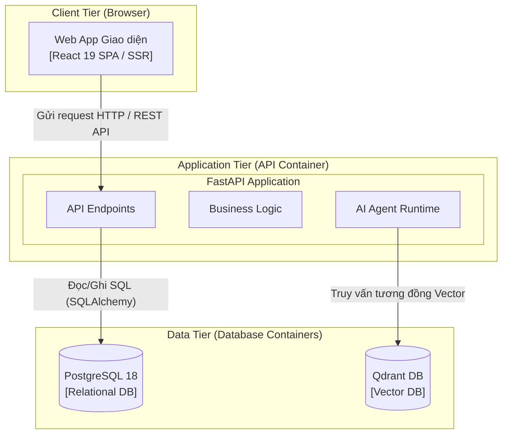
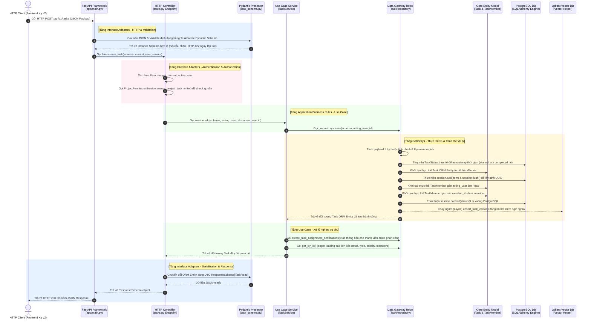

# Đặc tả Kiến trúc Chi tiết Dự án Agentick: Triển khai, Frontend và Backend

Tài liệu này mô tả chi tiết toàn bộ các khía cạnh kiến trúc cốt lõi của nền tảng quản lý công việc tích hợp AI **Agentick**. Nội dung tài liệu được thiết kế nhằm hệ thống hóa thông tin từ các slide thuyết trình, định nghĩa tường minh các khái niệm kiến trúc, và ánh xạ trực tiếp các lý thuyết thiết kế vào cấu trúc mã nguồn thực tế của cả hai dự án Frontend (`Agentick-FE`) và Backend (`Agentick-BE`).

---

## 1. KIẾN TRÚC TRIỂN KHAI (DEPLOYMENT ARCHITECTURE)

Kiến trúc triển khai mô tả cách các thành phần vật lý và logic của hệ thống được cài đặt, vận hành và giao tiếp với nhau trong môi trường thực tế.

### 1.1. Định nghĩa khái niệm các dạng kiến trúc liên quan

*   **Three-Tier Architecture (Kiến trúc 3 lớp):**
    *   *Khái niệm:* Là mô hình kiến trúc phần mềm chia ứng dụng thành 3 tầng logic và vật lý độc lập:
        1.  **Presentation Tier (Tầng hiển thị):** Giao diện người dùng (Client-side), chịu trách nhiệm tương tác và hiển thị thông tin (Web Browser / React).
        2.  **Application Tier (Tầng xử lý/Nghiệp vụ):** Máy chủ ứng dụng (Server-side), xử lý toàn bộ logic nghiệp vụ, xác thực và điều phối dữ liệu (FastAPI).
        3.  **Data Tier (Tầng dữ liệu):** Nơi lưu trữ và truy xuất dữ liệu có cấu trúc hoặc không có cấu trúc (PostgreSQL & Qdrant).
    *   *Mục đích:* Tách biệt các mối quan tâm (Separation of Concerns), giúp dễ dàng bảo trì, phát triển độc lập và tăng tính bảo mật cho tầng dữ liệu.
*   **Monolithic Architecture (Kiến trúc đơn khối):**
    *   *Khái niệm:* Là kiểu kiến trúc mà toàn bộ các module chức năng của một hệ thống (hoặc một phía FE/BE) được đóng gói và triển khai chung trong một đơn vị chạy duy nhất (single process / single container).
    *   *Đặc trưng:* Chia sẻ chung tài nguyên bộ nhớ, CPU, vòng đời khởi chạy và cơ sở dữ liệu.
*   **Modular Monolith (Kiến trúc đơn khối dạng Module):**
    *   *Khái niệm:* Là một biến thể nâng cao của Monolith, hoạt động như một bước đệm hoàn hảo giữa Monolith truyền thống và Microservices.
    *   *Đặc trưng:* Hệ thống vẫn được đóng gói và deploy dưới dạng một khối duy nhất (tiết kiệm chi phí vận hành), nhưng mã nguồn bên trong được tổ chức nghiêm ngặt thành các **Domain/Module** độc lập có ranh giới rõ ràng (Bounded Contexts). Các module này giao tiếp với nhau thông qua các giao diện công khai (Interfaces / Shared Services) hoặc cơ chế Event-driven nội bộ, tuyệt đối không được chọc trực tiếp vào database hay gọi xuyên biên giới bừa bãi.
*   **Microservices Architecture (Kiến trúc vi dịch vụ):**
    *   *Khái niệm:* Phân rã ứng dụng thành một tập hợp các dịch vụ rất nhỏ, chạy độc lập, tự chủ sở hữu database riêng, giao tiếp với nhau thông qua mạng (REST, gRPC, Message Queue) và có thể deploy độc lập.

### 1.2. Kiến trúc triển khai thực tế của dự án Agentick

> [!NOTE]
> Dự án Agentick hiện tại được triển khai theo mô hình **Three-Tier Architecture** kết hợp lối tiếp cận **Monolith** cho cả Frontend và Backend. Cả hai khối kết nối chặt chẽ qua giao thức RESTful API bảo mật.

#### Sơ đồ Kiến trúc vật lý dạng Đơn khối (Monolithic Topology):



#### Lý do lựa chọn giải pháp Monolith trong giai đoạn hiện tại:
1.  **Phù hợp giai đoạn sản phẩm:** Sản phẩm được triển khai trong thời gian ngắn nhằm mục đích nghiên cứu, demo tính năng AI Agent và tối ưu hóa MVP. Hệ thống chưa cần xử lý lượng truy cập đồng thời siêu lớn (High Availability/Massive Scale) nên cấu trúc Monolith giúp tăng tốc độ đưa sản phẩm ra thị trường.
2.  **Xử lý transaction đơn giản và nhất quán:** Nghiệp vụ quản lý dự án tích hợp AI của Agentick có nhiều mối liên kết phức tạp. Ví dụ, khi tạo một công việc (Task): hệ thống phải ghi đồng thời vào bảng `task`, bảng `task_member`, tạo các bản ghi `notification`, lưu vết `task_activity` và đồng bộ vector lên Qdrant. Kiến trúc Monolith cho phép quản lý các tác vụ này một cách nguyên tử (Atomicity) thông qua SQLAlchemy Session/Unit of Work mà không cần tới các giải pháp Distributed Transaction (như Saga pattern) cực kỳ phức tạp.
3.  **Dễ dàng làm việc nhóm và vận hành:** Việc đóng gói toàn bộ logic Backend trong một codebase duy nhất giúp việc chia sẻ môi trường phát triển rất đơn giản. Đội ngũ chỉ cần duy nhất một file `Dockerfile` để khởi chạy ứng dụng, dễ dàng quan sát log tập trung và CI/CD gọn nhẹ.

#### Nhược điểm của kiến trúc hiện tại:
*   **Hạn chế khả năng scale độc lập (Scalability Bottleneck):** Module AI Agent (`custom_agent.py` kết hợp xử lý LLM Prompts, RAG và gọi công cụ liên tục) tiêu tốn rất nhiều năng lực CPU/RAM. Khi số lượng tác vụ AI tăng đột biến, việc scale bắt buộc phải nhân bản toàn bộ container API Application khổng lồ, gây lãng phí tài nguyên cho các API CRUD thông thường.
*   **Nguy cơ suy thoái cấu trúc mã nguồn:** Nếu đội ngũ lập trình không tuân thủ nghiêm ngặt các ranh giới lớp, Monolith rất dễ biến thành một khối mã nguồn đan xen chéo cánh (Big Ball of Mud), làm mất đi tính độc lập giữa các tính năng.

#### Định hướng tương lai: Chuyển đổi sang Modular Monolith
Để khắc phục các nhược điểm trên mà không làm tăng quá mức chi phí hạ tầng, lộ trình tiếp theo của Agentick là chuẩn hóa cấu trúc thư mục và tách biệt logic nghiệp vụ thành các domain được phân chia ranh giới rõ ràng.
*   Mỗi chức năng (như `Auth`, `Project`, `Task`, `Agent`) sẽ được cô lập hoàn toàn về mặt logic.
*   Giao tiếp chéo giữa các domain chỉ được thực hiện thông qua các **Shared Services** nội bộ.
*   Khi cần thiết, ta có thể nhanh chóng bóc tách riêng module `Agent` nặng nề thành một Microservice độc lập mà không cần tái cấu trúc lại toàn bộ hệ thống.

---

## 2. KIẾN TRÚC FRONTEND (FE FEATURE-BASED ARCHITECTURE)

Phía Frontend (`Agentick-FE`), dự án áp dụng kiến trúc **Feature-based (Kiến trúc hướng tính năng)** nhằm tổ chức mã nguồn một cách khoa học, tăng cường tính module hóa và khả năng tái sử dụng.

### 2.1. Khái niệm Feature-based Architecture

*   *Khái niệm:* Thay vì tổ chức mã nguồn theo khía cạnh kỹ thuật (Technical-based: gom toàn bộ components vào thư mục `components`, gom toàn bộ hooks vào thư mục `hooks`, gom schemas vào thư mục `schemas` dùng chung cho toàn bộ app), Feature-based sẽ nhóm tất cả các tệp tin liên quan đến một tính năng nghiệp vụ cụ thể vào trong một thư mục duy nhất (Feature folder).
*   *Triết lý cốt lõi:* **"Co-locate code that changes together"** (Đặt những phần code thường thay đổi cùng nhau ở cạnh nhau). Một lập trình viên khi sửa đổi giao diện hoặc logic của tính năng `auth` sẽ chỉ cần thao tác bên trong thư mục `features/auth/` mà không cần tìm kiếm rải rác khắp dự án.

### 2.2. Tổ chức mã nguồn Frontend trong dự án Agentick

> [!TIP]
> Cấu trúc thư mục của dự án `Agentick-FE` phân chia rõ ràng các module nghiệp vụ lớn như: `auth`, `projects`, `tasks`, `teams`, `inbox`, `events`, `agent` dưới thư mục cha `src/features/`.

#### Cấu trúc giải phẫu chi tiết của một Feature Module (Anatomy of a Feature):

```
src/features/auth/            # Thư mục chứa tính năng Xác thực
├── components/               # Các UI components phục vụ riêng cho Auth (LoginForm, RegisterCard)
├── functions.ts              # Các hàm helper, tiện ích logic nội bộ của tính năng Auth
├── queries.ts                # Định nghĩa các Hooks TanStack Query (queries, mutations) cho Auth
├── schemas.ts                # Định nghĩa Zod Schemas để validate dữ liệu form phía Client
├── server.ts                 # Chứa các hàm gọi REST API bằng HTTP Client (thư viện Ky v2) tới Backend
└── index.ts                  # Entry point (Public API) xuất bản các components/hooks ra ngoài
```

#### Vai trò của từng thành phần trong Module:
1.  **`components/`:** Nơi xây dựng giao diện trực quan bằng React 19, Tailwind CSS v4 và thư viện thành phần shadcn/ui.
2.  **`functions.ts`:** Nơi xử lý các logic tính toán thuần túy (Pure Functions), giúp tách biệt mã hiển thị UI khỏi mã tính toán nghiệp vụ để dễ dàng viết unit tests.
3.  **`queries.ts`:** Sử dụng **TanStack Query** để quản lý trạng thái máy chủ (Server State). Nó đóng gói việc quản lý cache, tự động re-fetch dữ liệu khi mất kết nối, cập nhật UI tức thì (optimistic updates) và tối ưu hóa số lượng request.
4.  **`server.ts`:** Sử dụng thư viện **Ky v2** (HTTP client gọn nhẹ, mạnh mẽ hơn fetch mặc định) để gọi trực tiếp các API Endpoint của Backend.
5.  **`schemas.ts`:** Sử dụng **Zod** để định nghĩa kiểu dữ liệu và thực hiện validate nghiêm ngặt thông tin đầu vào ngay tại Client trước khi gửi request đi.
6.  **`index.ts`:** Hoạt động như một cổng bảo mật (Barrier). Nó chỉ export những gì các phần khác của dự án thực sự cần (ví dụ: export `useAuthStore` hoặc `LoginForm`), ẩn giấu toàn bộ chi tiết triển khai bên trong module nhằm tránh phụ thuộc chéo bừa bãi.

#### Lý do lựa chọn kiến trúc Feature-based:
*   **Dễ bảo trì và mở rộng:** Codebase cực kỳ rõ ràng, trực quan, không bị phình to lộn xộn khi dự án scale lên hàng trăm trang.
*   **Hỗ trợ làm việc nhóm song song tuyệt vời:** Mỗi lập trình viên có thể đảm nhận trọn vẹn một tính năng từ giao diện, validate form, xử lý cache đến kết nối API trong thư mục riêng của mình, triệt tiêu nguy cơ conflict khi merge mã nguồn.
*   **Sẵn sàng cho các kiến trúc lớn hơn:** Nhờ tính đóng gói độc lập cao, dự án rất dễ dàng bóc tách các feature thành các packages độc lập để chuyển đổi sang mô hình **Monorepo** hoặc kiến trúc **Micro-frontends** trong tương lai.
*   **Tối ưu hiệu năng qua Code-splitting:** Dễ dàng cấu hình lazy-loading cho từng trang dựa trên routing của TanStack Router, giúp giảm thiểu dung lượng file bundle tải về lần đầu cho trình duyệt.

---

## 3. KIẾN TRÚC BACKEND (BE CLEAN ARCHITECTURE)

Dự án `Agentick-BE` được thiết kế chặt chẽ theo nguyên lý **Clean Architecture**, giúp mã nguồn độc lập với các tác nhân bên ngoài (Framework, Cơ sở dữ liệu, UI) và tối đa hóa khả năng kiểm thử.

### 3.1. Khái niệm và Nguyên lý Clean Architecture

*   *Khái niệm:* Clean Architecture tổ chức hệ thống thành các vòng tròn đồng tâm đại diện cho các tầng trách nhiệm khác nhau.
*   **Dependency Rule (Quy tắc phụ thuộc):**
    *   Mối quan hệ phụ thuộc mã nguồn chỉ được phép **hướng vào trong**, tuyệt đối không bao giờ hướng ra ngoài.
    *   Tức là, mã nguồn ở các vòng tròn bên ngoài có thể biết và sử dụng mã nguồn ở vòng tròn bên trong, nhưng mã nguồn ở vòng tròn bên trong **không được phép có bất kỳ manh mối nào** về sự tồn tại của các thành phần bên ngoài (như không được gọi trực tiếp tên database, không chứa mã HTTP, không biết về API framework).

```
   ┌─────────────────────────────────────────────────────────┐
   │ 4. Frameworks & Drivers (FastAPI, SQLAlchemy, PG)      │
   │    ┌───────────────────────────────────────────────────┐│
   │    │ 3. Interface Adapters (Controllers, Repositories) ││
   │    │    ┌─────────────────────────────────────────────┐││
   │    │    │ 2. Application Business Rules (Services)    │││
   │    │    │    ┌───────────────────────────────────────┐│││
   │    │    │    │ 1. Enterprise Business Rules (Models) ││││
   │    │    │    └───────────────────────────────────────┘│││
   │    │    └─────────────────────────────────────────────┘││
   │    └───────────────────────────────────────────────────┘│
   └─────────────────────────────────────────────────────────┘
```

### 3.2. Cấu trúc ánh xạ thực tế trong codebase Agentick-BE

Dự án `Agentick-BE` hiện thực hóa Clean Architecture một cách hoàn hảo thông qua cấu trúc thư mục tương ứng 1:1 với 4 tầng kiến trúc chính:

#### 1. Enterprise Business Rules (Entities) — Thư mục `app/model/`
*   **Nhiệm vụ:** Chứa các thực thể dữ liệu cốt lõi và các quy tắc nghiệp vụ bền vững nhất của doanh nghiệp.
*   **Chi tiết mã nguồn:** Các SQLAlchemy ORM Models kế thừa từ `BaseModel` trong [app/model/base_model.py](file:///d:/Dev%20projects/Agentick-BE/app/model/base_model.py). Các thực thể này định nghĩa cấu trúc dữ liệu nền tảng và các mối quan hệ (Relationships) như:
    *   `Task` trong [app/model/task.py](file:///d:/Dev%20projects/Agentick-BE/app/model/task.py)
    *   `Project` trong [app/model/project.py](file:///d:/Dev%20projects/Agentick-BE/app/model/project.py)
    *   `User` trong [app/model/user.py](file:///d:/Dev%20projects/Agentick-BE/app/model/user.py)
    *   `TaskMember` trong [app/model/task_member.py](file:///d:/Dev%20projects/Agentick-BE/app/model/task_member.py)

#### 2. Application Business Rules (Use Cases) — Thư mục `app/services/`
*   **Nhiệm vụ:** Định nghĩa toàn bộ các kịch bản nghiệp vụ (Use Cases) của hệ thống. Nó điều phối dữ liệu đi qua các Entities, đưa ra các quyết định xử lý logic chính và quản lý Transaction.
*   **Chi tiết mã nguồn:** Các lớp Service kế thừa từ `BaseService` trong [app/services/base_service.py](file:///d:/Dev%20projects/Agentick-BE/app/services/base_service.py) như:
    *   `TaskService` trong [app/services/task_service.py](file:///d:/Dev%20projects/Agentick-BE/app/services/task_service.py): Điều phối các hoạt động CRUD, tạo thông báo và kích hoạt AI phân tích công việc.
    *   `ProjectService` trong [app/services/project_service.py](file:///d:/Dev%20projects/Agentick-BE/app/services/project_service.py)
    *   `ProjectPermissionService` trong [app/services/project_permission_service.py](file:///d:/Dev%20projects/Agentick-BE/app/services/project_permission_service.py): Thực thi các quy tắc kiểm tra quyền truy cập/ghi sâu của hệ thống.

#### 3. Interface Adapters — Thư mục `app/api/`, `app/repository/`, `app/schema/`
Tầng này đóng vai trò chuyển đổi định dạng dữ liệu linh hoạt:
*   **Controllers (FastAPI Endpoints) — `app/api/v1/endpoints/`:**
    *   *Nhiệm vụ:* Tiếp nhận HTTP request, xử lý Authentication (JWT), phân quyền ở mức Endpoint, gọi tầng Use Case (Services) tương ứng và đóng gói kết quả trả về bằng cấu trúc Response chuẩn.
    *   *Mã nguồn:* Ví dụ tệp [app/api/v1/endpoints/tasks.py](file:///d:/Dev%20projects/Agentick-BE/app/api/v1/endpoints/tasks.py) chứa hàm `create_task`.
*   **Gateways (Data Access Repositories) — `app/repository/`:**
    *   *Nhiệm vụ:* Đóng gói chi tiết truy vấn database (SQL / ORM). Use Cases chỉ giao tiếp với Repository qua phương thức trừu tượng, không hề biết cơ sở dữ liệu thực sự là PostgreSQL, MySQL hay NoSQL.
    *   *Mã nguồn:* Ví dụ tệp [app/repository/task_repository.py](file:///d:/Dev%20projects/Agentick-BE/app/repository/task_repository.py) chịu trách nhiệm chọc trực tiếp vào DB, tạo các bản ghi liên kết nâng cao và kích hoạt nền tảng Qdrant Vector DB để lưu trữ nhúng.
*   **Presenters (Data Validation & Serialization) — `app/schema/`:**
    *   *Nhiệm vụ:* Sử dụng **Pydantic** để xây dựng các DTO (Data Transfer Objects). Validate định dạng JSON đầu vào từ client và định hình cấu trúc JSON trả về.
    *   *Mã nguồn:* Tệp [app/schema/task_schema.py](file:///d:/Dev%20projects/Agentick-BE/app/schema/task_schema.py) định nghĩa `TaskCreate` (đầu vào) và `TaskRead` (đầu ra).

#### 4. Frameworks & Drivers
*   **Nhiệm vụ:** Chứa các công cụ vật lý thực tế ngoài rìa hệ thống.
*   **Dự án tích hợp:** FastAPI (web framework), PostgreSQL 18 (Cơ sở dữ liệu quan hệ chính), Qdrant (Cơ sở dữ liệu vector), Alembic (Công cụ sinh migration database), SMTP server (Gửi mail).

---

## 4. LUỒNG HOẠT ĐỘNG THỰC TẾ (REQUEST LIFECYCLE MAPPING)

Để minh chứng cho sự vận hành trơn tru của kiến trúc Clean Architecture trong dự án, dưới đây là phân tích chi tiết vòng đời của request **`POST /tasks`** (tạo mới công việc) ánh xạ trực tiếp từng dòng code thực tế trong codebase `Agentick-BE`.

### 4.1. Sơ đồ tuần tự nghiệp vụ (Sequence Flow)



### 4.2. Khớp mã nguồn thực tế (Direct Code Mapping)

#### Bước 1: Tiếp nhận và Validate HTTP Request
Tại endpoint định nghĩa ở [app/api/v1/endpoints/tasks.py](file:///d:/Dev%20projects/Agentick-BE/app/api/v1/endpoints/tasks.py#L35-L47):
```python
@router.post("", response_model=ResponseSchema[TaskRead])
def create_task(
    schema: TaskCreate,
    current_user: User = Depends(get_current_active_user),
    service: TaskService = Depends(get_task_service),
    permission_service: ProjectPermissionService = Depends(
        get_project_permission_service
    ),
):
    # Kiểm tra phân quyền ghi task của người dùng đối với project
    permission_service.ensure_project_task_write(schema.project_id, current_user.id)
    
    # Điều phối Use Case thực hiện tạo Task
    result = service.add(schema, acting_user_id=current_user.id)
    
    # Bọc dữ liệu trả về trong envelope ResponseSchema tiêu chuẩn
    return ResponseSchema(data=result, message="Task created successfully")
```
*   **Giải thích:**
    *   Hàm `create_task` đóng vai trò là một **Controller** (ở tầng *Interface Adapters*).
    *   `schema: TaskCreate` ([app/schema/task_schema.py](file:///d:/Dev%20projects/Agentick-BE/app/schema/task_schema.py#L35)) định nghĩa Pydantic model để validate dữ liệu gửi lên.
    *   `permission_service` thực thi các quy tắc kiểm soát quyền truy cập chéo một cách nghiêm ngặt.

#### Bước 2: Use Case Service điều phối nghiệp vụ
Tại lớp `TaskService` ở [app/services/task_service.py](file:///d:/Dev%20projects/Agentick-BE/app/services/task_service.py#L10-L16):
```python
    def add(self, schema: Any, acting_user_id: str = None) -> Any:
        # 1. Gọi Repo tạo bản ghi Task & TaskMember chính
        result = self._repository.create(schema, acting_user_id=acting_user_id)
        
        # 2. Xử lý logic nghiệp vụ phụ: Tạo thông báo phân công cho các thành viên được add vào task
        if hasattr(schema, "member_ids") and schema.member_ids:
            self._repository.create_task_assignment_notifications(
                result.id, schema.member_ids
            )
            
        # 3. Trả về Task đầy đủ thông tin eager load
        return self.get_by_id(result.id)
```
*   **Giải thích:**
    *   `TaskService` đại diện cho tầng **Application Business Rules (Use Cases)**.
    *   Dịch vụ này hoàn toàn không biết gì về cơ sở dữ liệu vật lý hay HTTP protocol. Nó chỉ nhận dữ liệu từ Controller dưới dạng Pydantic schema, phối hợp các luồng lưu trữ chính, kích hoạt tạo thông báo và trả về thực thể sạch.

#### Bước 3: Database Gateway thực thi đọc ghi vật lý
Tại lớp `TaskRepository` ở [app/repository/task_repository.py](file:///d:/Dev%20projects/Agentick-BE/app/repository/task_repository.py#L12-L74):
```python
    def create(self, schema, acting_user_id: str = None, auto_commit=True):
        data = schema.model_dump() if hasattr(schema, "model_dump") else schema
        member_ids = data.pop("member_ids", []) or []

        from app.model.task_status import TaskStatus
        from datetime import datetime, timezone

        with self.session_factory() as session:
            # Quy tắc nghiệp vụ tự động gán started_at/completed_at dựa theo trạng thái
            if "status_id" in data and data["status_id"]:
                new_status = (
                    session.query(TaskStatus).filter_by(id=data["status_id"]).first()
                )
                if new_status:
                    now_utc = datetime.now(timezone.utc)
                    if not data.get("started_at") and not new_status.is_default:
                        data["started_at"] = now_utc

                    if new_status.is_completed:
                        if not data.get("completed_at"):
                            data["completed_at"] = now_utc
                            if not data.get("started_at"):
                                data["started_at"] = now_utc

            # Khởi tạo thực thể SQLAlchemy Model (Enterprise Business Rule)
            item = self.model(**data)
            session.add(item)
            session.flush()  # Sinh ID UUID cho task trước khi gán quan hệ thành viên

            # 1. Thêm người tạo làm Lead (TaskMember)
            if acting_user_id:
                lead_member = TaskMember(
                    task_id=item.id, user_id=acting_user_id, role="lead"
                )
                session.add(lead_member)

            # 2. Thêm các thành viên bổ sung (TaskMember)
            for uid in member_ids:
                if uid == acting_user_id:
                    continue
                mbr = TaskMember(task_id=item.id, user_id=uid, role="member")
                session.add(mbr)

            if auto_commit:
                session.commit()
                session.refresh(item)

                # Chạy ngầm async đẩy Vector Embeddings lên cơ sở dữ liệu Vector Qdrant phục vụ tìm kiếm ngữ nghĩa
                from app.utils.qdrant_helper import (
                    upsert_task_vector,
                    run_async_background,
                )

                run_async_background(
                    upsert_task_vector(
                        item.id, item.title, item.description, item.project_id
                    )
                )
            else:
                session.flush()
            return item
```
*   **Giải thích:**
    *   `TaskRepository` là lớp thuộc tầng **Interface Adapters (Gateways)**.
    *   Tệp này làm nhiệm vụ liên lạc vật lý trực tiếp với PostgreSQL thông qua phiên làm việc của SQLAlchemy, chèn các bản ghi liên quan chéo (`TaskMember`), commit transaction, và chuyển dữ liệu sang chạy nền để chèn vector embeddings vào Qdrant Vector DB.

#### Bước 4: Chuyển đổi và phản hồi kết quả (Serialization)
*   Sau khi `TaskRepository` trả thực thể `Task` ORM về cho `TaskService`, Service tiếp tục nạp dữ liệu đầy đủ quan hệ thông qua phương thức `get_by_id(id)` với chế độ **Eager Loading** (tự động load trước các bảng `status`, `type`, `priority`, `task_members` để tránh lỗi N+1 Query).
*   Thực thể hoàn chỉnh được trả về cho Controller `create_task`.
*   Tại đây, FastAPI bắt lấy giá trị trả về và tự động thực hiện **Serialization** (chuyển đổi ORM Model thành JSON) nhờ định nghĩa `response_model=ResponseSchema[TaskRead]`.
*   `TaskRead` ([app/schema/task_schema.py](file:///d:/Dev%20projects/Agentick-BE/app/schema/task_schema.py#L67-L89)) chứa cấu hình `model_config = ConfigDict(from_attributes=True)` giúp Pydantic hiểu cách trích xuất dữ liệu trực tiếp từ các thuộc tính của đối tượng SQLAlchemy ORM Model.
*   Client nhận được JSON phản hồi tiêu chuẩn với tốc độ tối ưu và kiểu dữ liệu an toàn 100%.

---

## 5. BẢNG TỔNG HỢP SO SÁNH ÁNH XẠ KIẾN TRÚC

| Tầng Kiến trúc (Clean Architecture) | Vai trò khái niệm | Thành phần trong dự án Backend | Thành phần trong dự án Frontend |
| :--- | :--- | :--- | :--- |
| **Enterprise Business Rules (Entities)** | Thực thể lõi, lưu trữ dữ liệu nền tảng và các luật nghiệp vụ bền vững. | `app/model/` (SQLAlchemy Models: `Task`, `User`, `Project`,...) | `src/features/[feature]/schemas.ts` (Zod Schemas đại diện cấu trúc dữ liệu Client). |
| **Application Business Rules (Use Cases)** | Điều phối luồng nghiệp vụ chính, bảo vệ logic ứng dụng sạch. | `app/services/` (Services: `TaskService`, `RiskAnalysisService`,...) | `src/features/[feature]/functions.ts` (Pure logic helpers) & Zustand Stores (`src/stores/`). |
| **Interface Adapters (Controllers, Gateways, Presenters)** | Chuyển đổi giao tiếp giữa logic sạch và thế giới công nghệ bên ngoài. | `app/api/` (HTTP Routes), `app/repository/` (SQL queries), `app/schema/` (Pydantic DTOs). | `src/features/[feature]/server.ts` (Ky API Calls), `src/features/[feature]/queries.ts` (TanStack Query hooks). |
| **Frameworks & Drivers** | Hạ tầng, công nghệ vật lý cụ thể hỗ trợ chạy ứng dụng. | FastAPI, SQLAlchemy Engine, PostgreSQL 18, Qdrant, APScheduler, SMTP Server. | React 19, TanStack Start, TanStack Router, Tailwind CSS v4, shadcn/ui. |
