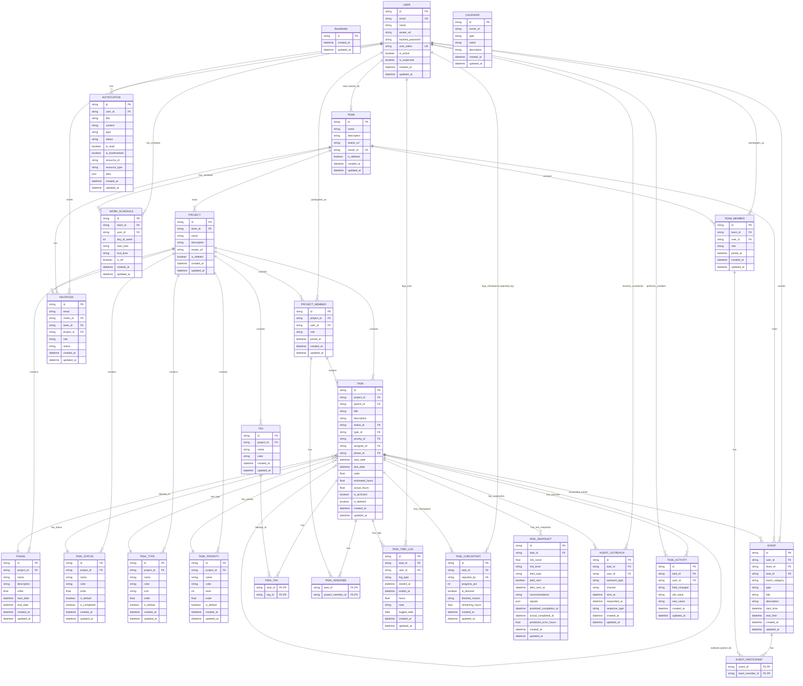

# Tài liệu Mô hình Cơ sở Dữ liệu (Database Models) - Agentick BE

Tài liệu này mô tả chi tiết toàn bộ các mô hình dữ liệu (Database Models) trong dự án **Agentick**, được định nghĩa bằng thư viện **SQLAlchemy 2.0 (Declarative Style)** và được trực quan hóa thông qua ngôn ngữ đặc tả **Mermaid.js** (một định dạng tiêu chuẩn dùng để vẽ biểu đồ quan hệ thực thể - ER Diagram trực tiếp trong Markdown).

---

## 1. Biểu đồ Quan hệ Thực thể (Entity-Relationship Diagram)

Dưới đây là sơ đồ ER mô tả mối quan hệ giữa các bảng trong hệ thống. Định dạng biểu đồ này sử dụng **Mermaid.js**, bạn có thể xem trực quan hóa của nó trực tiếp trên GitHub, VS Code hoặc bất kỳ trình đọc Markdown hiện đại nào.

---

## 2. Chi tiết Từng Mô hình (Model Specifications)

Mọi mô hình trong dự án đều kế thừa từ lớp trừu tượng `BaseModel` (được khai báo tại [base_model.py](file:///d:/Dev%20projects/Agentick-BE/app/model/base_model.py)), cung cấp 3 cột mặc định sau:
- **`id`**: `String(36)` - Khóa chính dạng UUIDv4 ngẫu nhiên.
- **`created_at`**: `DateTime` - Thời gian tạo bản ghi (múi giờ tự động lưu bằng database trigger/server_default).
- **`updated_at`**: `DateTime` - Thời gian cập nhật bản ghi cuối cùng (tự động cập nhật `onupdate`).

---

### 2.1. Nhóm Người dùng & Tổ chức (User & Team)

#### 1. [User](file:///d:/Dev%20projects/Agentick-BE/app/model/user.py) (Bảng `user`)
Lưu thông tin cá nhân của người dùng tham gia hệ thống.
- **Trường dữ liệu:**
  - `email` (`String(255)`): Duy nhất, bắt buộc, đánh chỉ mục (`index=True`).
  - `name` (`String(255)`): Tên người dùng.
  - `avatar_url` (`String(512)`, nullable): Đường dẫn ảnh đại diện.
  - `hashed_password` (`String(255)`): Mật khẩu băm an toàn.
  - `user_token` (`String(64)`): Token duy nhất định danh người dùng, đánh chỉ mục.
  - `is_active` (`Boolean`, default `True`): Trạng thái kích hoạt.
  - `is_superuser` (`Boolean`, default `False`): Quyền quản trị tối cao.
- **Quan hệ:**
  - `owned_teams` (Quan hệ 1-N với `Team` thông qua `owner_id`).
  - `notifications` (Quan hệ 1-N với `Notification` thông qua `user_id`, cascade xóa).

#### 2. [Team](file:///d:/Dev%20projects/Agentick-BE/app/model/team.py) (Bảng `team`)
Tổ chức lớn chứa nhiều dự án và thành viên.
- **Trường dữ liệu:**
  - `name` (`String(255)`): Tên tổ chức/nhóm.
  - `description` (`String(512)`, nullable): Mô tả nhóm.
  - `avatar_url` (`String(512)`, nullable): Đường dẫn ảnh đại diện nhóm.
  - `owner_id` (`String(36)`): Khóa ngoại liên kết tới [User](file:///d:/Dev%20projects/Agentick-BE/app/model/user.py).
  - `is_deleted` (`Boolean`, default `False`): Trạng thái xóa mềm.
- **Quan hệ:**
  - `owner` (Quan hệ N-1 với `User`).
  - `members` (Quan hệ 1-N với `TeamMember`, cascade xóa).
  - `projects` (Quan hệ 1-N với `Project`, cascade xóa).

#### 3. [TeamMember](file:///d:/Dev%20projects/Agentick-BE/app/model/team_member.py) (Bảng `team_member`)
Bảng liên kết thể hiện thành viên thuộc một `Team` và vai trò tương ứng.
- **Trường dữ liệu:**
  - `team_id` (`String(36)`): Khóa ngoại liên kết tới `Team`.
  - `user_id` (`String(36)`): Khóa ngoại liên kết tới `User`.
  - `role` (`String(50)`, default `"member"`): Vai trò của thành viên trong nhóm (lấy từ enum `MemberRole` gồm `owner`, `manager`, `member`, `viewer`).
  - `joined_at` (`DateTime`): Thời điểm gia nhập nhóm.
- **Quan hệ:**
  - `team` (Quan hệ N-1 với `Team`).
  - `user` (Quan hệ N-1 với `User`).

---

### 2.2. Nhóm Quản lý Dự án (Project & Member)

#### 4. [Project](file:///d:/Dev%20projects/Agentick-BE/app/model/project.py) (Bảng `project`)
Dự án cụ thể trực thuộc một `Team`.
- **Trường dữ liệu:**
  - `team_id` (`String(36)`): Khóa ngoại liên kết tới `Team`.
  - `name` (`String(255)`): Tên dự án.
  - `description` (`String(512)`, nullable): Mô tả dự án.
  - `avatar_url` (`String(512)`, nullable): Ảnh đại diện dự án.
  - `is_deleted` (`Boolean`, default `False`): Trạng thái xóa mềm.
- **Quan hệ:**
  - `team` (Quan hệ N-1 với `Team`).
  - `members` (Quan hệ 1-N với `ProjectMember`, cascade xóa).

#### 5. [ProjectMember](file:///d:/Dev%20projects/Agentick-BE/app/model/project_member.py) (Bảng `project_member`)
Thành viên thuộc một dự án (được kế thừa/giao việc từ danh sách thành viên của nhóm).
- **Trường dữ liệu:**
  - `project_id` (`String(36)`): Khóa ngoại liên kết tới `Project`.
  - `user_id` (`String(36)`): Khóa ngoại liên kết tới `User`.
  - `role` (`String(50)`, default `"member"`): Vai trò trong dự án (lấy từ `MemberRole`).
  - `joined_at` (`DateTime`): Thời điểm gia nhập dự án.
- **Quan hệ:**
  - `project` (Quan hệ N-1 với `Project`).
  - `user` (Quan hệ N-1 với `User`).

---

### 2.3. Cấu trúc Công việc & Giai đoạn (Phases & Tasks)

#### 6. [Phase](file:///d:/Dev%20projects/Agentick-BE/app/model/phase.py) (Bảng `phase`)
Các giai đoạn (Phases / Milestones) thuộc một `Project`.
- **Trường dữ liệu:**
  - `project_id` (`String(36)`): Khóa ngoại liên kết tới `Project`.
  - `name` (`String(255)`): Tên giai đoạn.
  - `description` (`Text`, nullable): Mô tả giai đoạn.
  - `order` (`Float`, default `0.0`): Thứ tự sắp xếp giai đoạn trong dự án.
  - `start_date` (`DateTime`, nullable): Ngày bắt đầu giai đoạn.
  - `end_date` (`DateTime`, nullable): Ngày dự kiến kết thúc.
- **Quan hệ:**
  - `project` (Quan hệ N-1 với `Project`).
  - `tasks` (Quan hệ 1-N với `Task`).

#### 7. [Task](file:///d:/Dev%20projects/Agentick-BE/app/model/task.py) (Bảng `task`)
Công việc cụ thể cần thực hiện trong dự án. Model này hỗ trợ **cấu trúc cây phân cấp (Subtasks)** thông qua quan hệ tự liên kết (Self-referential).
- **Trường dữ liệu:**
  - `project_id` (`String(36)`): Khóa ngoại liên kết tới `Project`.
  - `parent_id` (`String(36)`, nullable): Khóa ngoại liên kết ngược lại `Task.id` để định nghĩa công việc cha (Parent Task).
  - `title` (`String(255)`): Tiêu đề công việc.
  - `description` (`Text`, nullable): Mô tả chi tiết công việc.
  - `status_id` (`String(36)`): Khóa ngoại liên kết tới `TaskStatus`.
  - `type_id` (`String(36)`): Khóa ngoại liên kết tới `TaskType`.
  - `priority_id` (`String(36)`): Khóa ngoại liên kết tới `TaskPriority`.
  - `assigner_id` (`String(36)`): Khóa ngoại liên kết tới `ProjectMember` (người giao việc).
  - `phase_id` (`String(36)`, nullable): Khóa ngoại liên kết tới `Phase`.
  - `start_date` (`DateTime`, nullable): Ngày bắt đầu công việc.
  - `due_date` (`DateTime`, nullable): Hạn chót công việc.
  - `order` (`Float`, default `0.0`): Thứ tự sắp xếp công việc (ví dụ trong bảng Kanban hoặc danh sách).
  - `estimated_hours` (`Float`, nullable): Thời lượng ước tính ban đầu để hoàn thành công việc (phục vụ dự đoán rủi ro).
  - `actual_hours` (`Float`, default `0.0`): Tổng số giờ làm việc thực tế đã ghi nhận.
  - `is_archived` (`Boolean`, default `False`): Trạng thái lưu trữ công việc.
  - `is_deleted` (`Boolean`, default `False`): Trạng thái xóa mềm.
- **Quan hệ:**
  - `project` (Quan hệ N-1 với `Project`).
  - `status` (Quan hệ N-1 với `TaskStatus`).
  - `type` (Quan hệ N-1 với `TaskType`).
  - `priority` (Quan hệ N-1 với `TaskPriority`).
  - `assigner` (Quan hệ N-1 với `ProjectMember` thông qua `assigner_id`).
  - `assignees` (Quan hệ N-N với `ProjectMember` thông qua bảng trung gian `task_assignee`).
  - `phase` (Quan hệ N-1 với `Phase`).
  - `tags` (Quan hệ N-N với `Tag` thông qua bảng trung gian `task_tag`).
  - `parent` / `sub_tasks` (Quan hệ tự liên kết 1-N để định nghĩa nhiệm vụ cha/nhiệm vụ con).

---

### 2.4. Thuộc tính Công việc (Task Attributes)

Các mô hình này định nghĩa thuộc tính tùy biến cho từng dự án, giúp quản lý công việc linh hoạt hơn.

#### 8. [Tag](file:///d:/Dev%20projects/Agentick-BE/app/model/tag.py) (Bảng `tag`)
Thẻ phân loại công việc thuộc dự án.
- **Trường dữ liệu:**
  - `project_id` (`String(36)`): Khóa ngoại liên kết tới `Project`.
  - `name` (`String(50)`): Tên thẻ.
  - `color` (`String(20)`): Mã màu HEX hiển thị.
- **Quan hệ:**
  - `project` (Quan hệ N-1 với `Project`).
  - `tasks` (Quan hệ N-N với `Task` qua bảng trung gian `task_tag`).

#### 9. [TaskStatus](file:///d:/Dev%20projects/Agentick-BE/app/model/task_status.py) (Bảng `task_status`)
Trạng thái của công việc trong quy trình (ví dụ: To Do, In Progress, Review, Done).
- **Trường dữ liệu:**
  - `project_id` (`String(36)`): Khóa ngoại liên kết tới `Project`.
  - `name` (`String(50)`): Tên trạng thái.
  - `color` (`String(20)`): Mã màu hiển thị.
  - `order` (`Float`, default `0.0`): Thứ tự hiển thị cột trạng thái.
  - `is_default` (`Boolean`, default `False`): Trạng thái mặc định khi tạo Task mới.
  - `is_completed` (`Boolean`, default `False`): Đánh dấu trạng thái này là đã hoàn thành công việc.

#### 10. [TaskType](file:///d:/Dev%20projects/Agentick-BE/app/model/task_type.py) (Bảng `task_type`)
Loại hình công việc (ví dụ: Task, Bug, Feature, Epic).
- **Trường dữ liệu:**
  - `project_id` (`String(36)`): Khóa ngoại liên kết tới `Project`.
  - `name` (`String(50)`): Tên loại công việc.
  - `color` (`String(20)`): Mã màu đại diện.
  - `icon` (`String(100)`, nullable): Icon biểu diễn.
  - `order` (`Float`, default `0.0`): Thứ tự sắp xếp.
  - `is_default` (`Boolean`, default `False`): Loại công việc mặc định.

#### 11. [TaskPriority](file:///d:/Dev%20projects/Agentick-BE/app/model/task_priority.py) (Bảng `task_priority`)
Độ ưu tiên của công việc (ví dụ: Low, Medium, High, Urgent).
- **Trường dữ liệu:**
  - `project_id` (`String(36)`): Khóa ngoại liên kết tới `Project`.
  - `name` (`String(50)`): Tên độ ưu tiên.
  - `color` (`String(20)`): Mã màu.
  - `level` (`Integer`, default `0`): Trọng số ưu tiên để sắp xếp logic.
  - `order` (`Float`, default `0.0`): Thứ tự sắp xếp.
  - `is_default` (`Boolean`, default `False`): Mức ưu tiên mặc định.

---

### 2.5. Hệ thống Lịch & Sự kiện & Lịch làm việc

#### 12. [WorkSchedule](file:///d:/Dev%20projects/Agentick-BE/app/model/work_schedule.py) (Bảng `work_schedule`)
Thời gian biểu làm việc trong tuần của một `Team` hoặc một `User`.
- **Trường dữ liệu:**
  - `team_id` (`String(36)`, nullable): Khóa ngoại liên kết tới `Team` (Lịch làm việc chung của Team).
  - `user_id` (`String(36)`, nullable): Khóa ngoại liên kết tới `User` (Lịch làm việc riêng của cá nhân).
  - `day_of_week` (`Integer`): Ngày trong tuần (0 = Thứ Hai, ..., 6 = Chủ Nhật).
  - `start_time` (`String(8)`, nullable): Định dạng giờ bắt đầu `"HH:MM"`.
  - `end_time` (`String(8)`, nullable): Định dạng giờ kết thúc `"HH:MM"`.
  - `is_off` (`Boolean`, default `False`): Đánh dấu ngày nghỉ làm việc.
- **Quan hệ:**
  - `team` (Quan hệ N-1 với `Team`).
  - `user` (Quan hệ N-1 với `User`).

#### 13. [Calendar](file:///d:/Dev%20projects/Agentick-BE/app/model/calendar.py) (Bảng `calendar`)
Đối tượng Lịch biểu, hỗ trợ phân loại cá nhân hoặc nhóm.
- **Trường dữ liệu:**
  - `owner_id` (`String(36)`): ID của chủ sở hữu (Có thể là ID của `User` hoặc `Team` tùy thuộc vào trường `type`).
  - `type` (`String(50)`): Loại lịch (`personal` hoặc `team` từ enum `CalendarType`).
  - `name` (`String(255)`, nullable): Tên lịch biểu.
  - `description` (`String(512)`, nullable): Mô tả.

#### 14. [Event](file:///d:/Dev%20projects/Agentick-BE/app/model/event.py) (Bảng `event`)
Sự kiện diễn ra trên lịch biểu (Cuộc họp, giờ tập trung, xin nghỉ phép, v.v.).
- **Trường dữ liệu:**
  - `user_id` (`String(36)`): Khóa ngoại liên kết tới `User` (Người tạo sự kiện).
  - `team_id` (`String(36)`): Khóa ngoại liên kết tới `Team` (Sự kiện thuộc về Nhóm nào).
  - `task_id` (`String(36)`, nullable): Khóa ngoại liên kết tới `Task` để xác định sự kiện này dành cho công việc cụ thể nào.
  - `event_category` (`String(50)`, nullable): Danh mục sự kiện (phục vụ mục đích theo dõi và tính toán phân bổ thời gian thực tế của Agent).
  - `type` (`String(50)`): Loại sự kiện (từ enum `EventType` gồm `meeting`, `focus_time`, `leave`).
  - `title` (`String(255)`): Tiêu đề sự kiện.
  - `description` (`Text`, nullable): Mô tả sự kiện.
  - `start_time` (`DateTime`): Thời điểm bắt đầu sự kiện.
  - `end_time` (`DateTime`): Thời điểm kết thúc sự kiện.
- **Quan hệ:**
  - `user` (Quan hệ N-1 với `User`).
  - `team` (Quan hệ N-1 với `Team`).
  - `task` (Quan hệ N-1 với `Task`).
  - `participants` (Quan hệ N-N với `TeamMember` thông qua bảng trung gian `event_participant` biểu thị những ai tham gia sự kiện).

---

### 2.6. Hệ thống Tương tác (Invitations & Notifications)

#### 15. [Invitation](file:///d:/Dev%20projects/Agentick-BE/app/model/invitation.py) (Bảng `invitation`)
Lời mời tham gia `Team` hoặc `Project` gửi tới email của người nhận.
- **Trường dữ liệu:**
  - `email` (`String(255)`): Email người được mời.
  - `inviter_id` (`String(36)`): Khóa ngoại liên kết tới `User` gửi lời mời.
  - `team_id` (`String(36)`, nullable): Khóa ngoại liên kết tới `Team` được mời tham gia.
  - `project_id` (`String(36)`, nullable): Khóa ngoại liên kết tới `Project` được mời tham gia.
  - `role` (`String(50)`, default `"member"`): Vai trò đề xuất khi chấp nhận lời mời.
  - `status` (`Enum`): Trạng thái lời mời (`InvitationStatus` gồm `PENDING`, `ACCEPTED`, `DECLINED`).
- **Quan hệ:**
  - `inviter` (Quan hệ N-1 với `User` gửi mời).
  - `team` (Quan hệ N-1 với `Team`).
  - `project` (Quan hệ N-1 với `Project`).

#### 16. [Notification](file:///d:/Dev%20projects/Agentick-BE/app/model/notification.py) (Bảng `notification`)
Hệ thống thông báo đẩy tới người dùng.
- **Trường dữ liệu:**
  - `user_id` (`String(36)`): Khóa ngoại liên kết tới [User](file:///d:/Dev%20projects/Agentick-BE/app/model/user.py) nhận thông báo.
  - `title` (`String(255)`): Tiêu đề thông báo.
  - `content` (`String(1000)`, nullable): Nội dung chi tiết thông báo.
  - `type` (`Enum`): Loại thông báo (`NotificationType` gồm `SYSTEM`, `INVITATION`, `TASK_ASSIGNED`, `PROJECT_UPDATE`).
  - `status` (`Enum`): Trạng thái lưu trữ của thông báo (`NotificationStatus` gồm `ACTIVE`, `ARCHIVED`, `BOOKMARKED`, `DELETED`).
  - `is_read` (`Boolean`, default `False`): Đã đọc chưa.
  - `is_bookmarked` (`Boolean`, default `False`): Đã lưu dấu chưa.
  - `resource_id` (`String(36)`, nullable): ID của tài nguyên liên quan (Ví dụ: id của invitation, id của task,...).
  - `resource_type` (`String(50)`, nullable): Loại tài nguyên (ví dụ: `"invitation"`, `"task"`).
  - `data` (`JSON`, nullable): Metadata phụ đi kèm dạng JSON để hiển thị động thông tin trên Frontend.
- **Quan hệ:**
  - `user` (Quan hệ N-1 với `User`).

### 2.7. Hệ thống Theo dõi Thời gian, Rủi ro & Tiếp cận Thành viên (Time Logging, Checkpoints, Risk, & Outreach)

#### 17. [TaskTimeLog](file:///d:/Dev%20projects/Agentick-BE/app/model/task_time_log.py) (Bảng `task_time_log`)
Ghi nhận thời gian thực tế đã bỏ ra cho một Task bởi thành viên cụ thể.
- **Trường dữ liệu:**
  - `task_id` (`String(36)`): Khóa ngoại liên kết tới `Task`.
  - `user_id` (`String(36)`): Khóa ngoại liên kết tới `User` người thực hiện ghi nhận.
  - `log_type` (`String(20)`): Loại ghi nhận (`timer` hoặc `manual`).
  - `started_at` (`DateTime`, nullable): Thời điểm bắt đầu ghi nhận (dành cho timer).
  - `ended_at` (`DateTime`, nullable): Thời điểm kết thúc ghi nhận (dành cho timer).
  - `hours` (`Float`): Số giờ thực tế đã làm việc.
  - `note` (`String(500)`, nullable): Ghi chú mô tả phần việc đã thực hiện.
  - `logged_date` (`Date`): Ngày làm việc được ghi nhận.
- **Quan hệ:**
  - `task` (Quan hệ N-1 với `Task`).
  - `user` (Quan hệ N-1 với `User`).

#### 18. [TaskCheckpoint](file:///d:/Dev%20projects/Agentick-BE/app/model/task_checkpoint.py) (Bảng `task_checkpoint`)
Lưu giữ tiến độ cập nhật thực tế tại các thời điểm kiểm tra của Task.
- **Trường dữ liệu:**
  - `task_id` (`String(36)`): Khóa ngoại liên kết tới `Task`.
  - `reported_by` (`String(36)`): Khóa ngoại liên kết tới `User` ghi nhận checkpoint.
  - `progress_pct` (`Integer`): Phần trăm tiến độ công việc (từ `0` đến `100`).
  - `is_blocked` (`Boolean`, default `False`): Trạng thái công việc bị nghẽn (blocked) hay không.
  - `blocked_reason` (`String(500)`, nullable): Lý do công việc bị nghẽn.
  - `remaining_hours` (`Float`, nullable): Số giờ ước tính còn lại cần thiết để hoàn thành công việc.
- **Quan hệ:**
  - `task` (Quan hệ N-1 với `Task`).
  - `reporter` (Quan hệ N-1 với `User` thông qua `reported_by`).

#### 19. [RiskSnapshot](file:///d:/Dev%20projects/Agentick-BE/app/model/risk_snapshot.py) (Bảng `risk_snapshot`)
Ảnh chụp rủi ro công việc được phân tích và đánh giá tự động bởi AI Agent tại một thời điểm cụ thể.
- **Trường dữ liệu:**
  - `task_id` (`String(36)`): Khóa ngoại liên kết tới `Task`.
  - `risk_score` (`Float`): Điểm số rủi ro (từ `0.0` đến `1.0`).
  - `risk_level` (`String(20)`): Phân loại mức độ rủi ro (`low`, `medium`, `high`, `critical`).
  - `alert_type` (`String(50)`, nullable): Loại cảnh báo rủi ro kích hoạt (`data_gap`, `stale`, `high_risk`).
  - `alert_sent` (`Boolean`, default `False`): Đã gửi cảnh báo liên hệ người dùng hay chưa.
  - `alert_sent_at` (`DateTime`, nullable): Thời điểm gửi cảnh báo.
  - `signals` (`JSON`, nullable): Các tín hiệu/dữ liệu rủi ro phân tích bởi AI.
  - `recommendation` (`Text`, nullable): Đề xuất giải quyết rủi ro do AI đưa ra.
  - `predicted_completion_at` (`DateTime`, nullable): Thời điểm AI dự báo công việc sẽ hoàn thành.
  - `actual_completed_at` (`DateTime`, nullable): Thời điểm công việc thực tế đã hoàn thành.
  - `prediction_error_hours` (`Float`, nullable): Sai số giữa thời gian hoàn thành thực tế và thời gian AI dự báo (tính bằng giờ).
- **Quan hệ:**
  - `task` (Quan hệ N-1 với `Task`).

#### 20. [AgentOutreach](file:///d:/Dev%20projects/Agentick-BE/app/model/agent_outreach.py) (Bảng `agent_outreach`)
Lịch sử Agent chủ động tương tác ra bên ngoài hệ thống với người dùng để hỏi thông tin hoặc cảnh báo.
- **Trường dữ liệu:**
  - `task_id` (`String(36)`): Khóa ngoại liên kết tới `Task`.
  - `user_id` (`String(36)`): Khóa ngoại liên kết tới `User` người nhận thông tin.
  - `outreach_type` (`String(50)`): Loại tiếp cận (`missing_estimate`, `missing_progress`, `stale_update`).
  - `channel` (`String(20)`): Kênh tương tác tiếp cận (`email`, `telegram`, `in_app`).
  - `sent_at` (`DateTime`): Thời điểm gửi tiếp cận thực tế.
  - `responded_at` (`DateTime`, nullable): Thời điểm người dùng phản hồi tiếp cận.
  - `response_type` (`String(50)`, nullable): Loại phản hồi của người dùng (`updated_task`, `ignored`, `snoozed`).
- **Quan hệ:**
  - `task` (Quan hệ N-1 với `Task`).
  - `user` (Quan hệ N-1 with `User`).

#### 21. [TaskActivity](file:///d:/Dev%20projects/Agentick-BE/app/model/task_activity.py) (Bảng `task_activity`)
Ghi nhận lịch sử thay đổi các trường dữ liệu của Task bởi người dùng.
- **Trường dữ liệu:**
  - `task_id` (`String(36)`): Khóa ngoại liên kết tới `Task`, tự động xóa khi Task bị xóa (`ondelete="CASCADE"`), đánh chỉ mục (`index=True`).
  - `user_id` (`String(36)`): Khóa ngoại liên kết tới `User` thực hiện thay đổi.
  - `field_changed` (`String(50)`): Tên trường dữ liệu thay đổi.
  - `old_value` (`String(255)`, nullable): Giá trị cũ trước khi thay đổi.
  - `new_value` (`String(255)`, nullable): Giá trị mới sau khi thay đổi.
- **Quan hệ:**
  - `task` (Quan hệ N-1 với `Task`).
  - `user` (Quan hệ N-1 với `User`).

---

## 3. Các Bảng Liên kết Nhiều-Nhiều (Many-to-Many Association Tables)

Hệ thống sử dụng các bảng trung gian phụ để biểu diễn quan hệ Nhiều-Nhiều (Many-to-Many) chuẩn mực:

1. **`task_tag`**: Liên kết `Task` <-> `Tag`.
   - `task_id` (`String(36)`, khóa chính, khóa ngoại liên kết tới `task.id`, `ondelete="CASCADE"`).
   - `tag_id` (`String(36)`, khóa chính, khóa ngoại liên kết tới `tag.id`, `ondelete="CASCADE"`).

2. **`task_assignee`**: Liên kết `Task` <-> `ProjectMember`.
   - `task_id` (`String(36)`, khóa chính, khóa ngoại liên kết tới `task.id`, `ondelete="CASCADE"`).
   - `project_member_id` (`String(36)`, khóa chính, khóa ngoại liên kết tới `project_member.id`, `ondelete="CASCADE"`).

3. **`event_participant`**: Liên kết `Event` <-> `TeamMember`.
   - `event_id` (`String(36)`, khóa chính, khóa ngoại liên kết tới `event.id`, `ondelete="CASCADE"`).
   - `team_member_id` (`String(36)`, khóa chính, khóa ngoại liên kết tới `team_member.id`, `ondelete="CASCADE"`).
